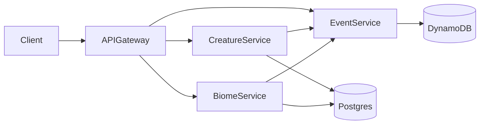
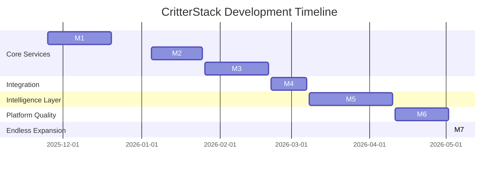

# CritterStack
*A distributed microservice ecosystem maintained by the Department of Peculiar Creatures.*

---

## Overview

CritterStack is a hands-on learning project: a whimsical ecosystem simulator built to explore backend architecture, microservices, distributed data, event-driven patterns, and clean API design.

The premise is simple:

The **Department of Peculiar Creatures** has reopened its dusty archives and needs a modern platform to catalog, monitor, and occasionally wrangle the strange fauna under its care. You’ll build that platform as a set of independent but cooperating microservices.

This project focuses on learning:

- Service boundaries and modular design
- API contracts and schema evolution
- Data modeling with Postgres & DynamoDB
- Event-based communication
- Reliability and observability patterns
- CI/CD basics and incremental delivery
- Git workflows used by senior engineers

The goal isn’t perfection — it’s *iteration*. Every service, improvement, and refactor teaches something new.

---

## High-Level Architecture

CritterStack consists of a small collection of microservices, each responsible for a slice of the ecosystem. The initial services are:

- **Creature Service** — manages creature identities, traits, stats, and lifecycle
- **Biome Service** — defines environments and biome rules
- **Event Service** — append-only historical event store
- **API Gateway** — unified entrypoint for all clients
- **Observability Stack** — logs, metrics, tracing

### Architecture Diagram



---

## Project at a Glance

### **Frontend** ✅ **LIVE**
A whimsical web interface for managing creatures.

**Features:**
- ✅ View all creatures in a magical card layout
- ✅ Search creature by ID
- ✅ Create new creatures with form
- ✅ Species dropdown with lore display
- ✅ Random name generator
- ✅ Toast notifications
- ✅ Responsive design with nature theme

**Tech:**
- React + Vite
- Modern CSS with gradients and animations
- Fetch API for backend communication

**Access:** `http://localhost:5173` (when running)

### **Creature Service** ✅ **LIVE**
The first service is fully operational!

**Implemented:**
- ✅ Creature CRUD operations (Create, Read)
- ✅ RESTful API with Express
- ✅ PostgreSQL database with Prisma ORM
- ✅ Zod validation
- ✅ Health check endpoint
- ✅ CORS enabled
- ✅ 100% test coverage on service layer

**Tech:**
- Node.js + Express 5
- Prisma + PostgreSQL
- Zod validation
- Jest testing

**Endpoints:**
- `GET /health` - Service health
- `GET /creatures` - List all creatures
- `GET /creatures/:id` - Get creature by ID
- `POST /creatures` - Create new creature

[📖 Full Documentation](./creature-service/README.md)

---

---

### **Biome Service** 🚧 **PLANNED**
Handles:
- Biomes, climates, and special rules
- Creature–biome compatibility

Tech:
- Django REST Framework
- Postgres

---

### **Event Service** 🚧 **PLANNED**
Handles:
- Append-only event log
- Ecosystem history
- Filtering & querying

Tech:
- Node.js
- DynamoDB

---

### **API Gateway** 🚧 **PLANNED**
The single external touchpoint for all services.

Tech:
- Node.js
- Express or Fastify
- OpenAPI contract-first design

---

## Quick Start

Want to see it in action? Here's how to run the current implementation:

### **Prerequisites**
- Node.js (LTS version recommended)
- Docker & Docker Compose
- Git

### **Run the Full Stack**

```bash
# 1. Clone the repository
git clone git@github.com:ElleWhitePB/CritterStack.git
cd CritterStack

# 2. Start the database
cd docker
docker compose up -d
cd ..

# 3. Set up and start the backend (in terminal 1)
cd creature-service
npm install
npx prisma migrate dev
npm run dev
# Backend runs on http://localhost:3000

# 4. Set up and start the frontend (in terminal 2)
cd frontend
npm install
npm run dev
# Frontend runs on http://localhost:5173
```

### **Try It Out**

1. Open your browser to `http://localhost:5173`
2. Click "Get All Creatures" to see existing creatures
3. Use "Create Creature" to add a new one:
   - Enter a name (or click 🎲 for a random name)
   - Choose a species from the dropdown
   - Read the species lore
   - Click "Create Creature"
4. Use "Get by ID" to fetch a specific creature

### **Run Tests**

```bash
cd creature-service
npm test                # Run all tests
npm run test:coverage   # Run with coverage report
```

---

## Getting Started (Detailed)

### **Prerequisites**
- Node.js (LTS)
- Python 3.10+ (for future services)
- Docker (recommended)
- PostgreSQL
- DynamoDB Local (for future Event Service)

### **Local Setup**

Clone the repo:

```bash
git clone git@github.com:ElleWhitePB/CritterStack.git
cd CritterStack
```

Install service dependencies:

```bash
cd creature-service
npm install
npx prisma migrate dev
```

Start databases:

```bash
cd docker
docker compose up -d
```

---

## Project Structure

```
CritterStack/
├── creature-service/          # ✅ Backend API service
│   ├── src/
│   │   ├── db/               # Prisma client
│   │   ├── routes/           # Express routes
│   │   ├── schemas/          # Zod validation
│   │   ├── services/         # Business logic
│   │   └── index.js          # Entry point
│   ├── tests/                # Unit tests (100% coverage)
│   ├── prisma/               # Database schema & migrations
│   ├── jest.config.js
│   ├── package.json
│   └── README.md
│
├── frontend/                  # ✅ React web interface
│   ├── src/
│   │   ├── components/       # React components
│   │   ├── constants/        # Species data
│   │   ├── services/         # API client
│   │   ├── utils/            # Helper functions
│   │   ├── App.jsx           # Main app component
│   │   └── App.css           # Styling
│   ├── package.json
│   └── vite.config.js
│
├── docker/                    # ✅ Database containers
│   └── docker-compose.yml    # PostgreSQL setup
│
├── biome-service/             # 🚧 Planned
├── event-service/             # 🚧 Planned
├── api-gateway/               # 🚧 Planned
│
└── README.md                  # This file
```

---


## Project Milestones (Learning Roadmap)

Each milestone focuses on a distinct backend skillset.
Taken together, they build a full distributed ecosystem.

---

### **M1: Creature Service MVP** ✅ **COMPLETED**

**Goal:** Kickstart the entire project with the first domain service and database layer.

#### Original Plan
The initial milestone was designed to establish the foundation:
- Initialize Node service
- Docker Compose + Postgres
- Prisma schema & migrations
- `POST /creatures`
- `GET /creatures/:id`
- Zod validation
- `/health` endpoint
- Basic tests
- Documentation

**Original Tech Stack:**
- Node.js + Fastify
- Prisma + Postgres
- Zod validation

#### What Was Actually Implemented

**Core Requirements (All Met):**
- ✅ Node.js service with Express 5 (chose Express over Fastify)
- ✅ Docker Compose with PostgreSQL
- ✅ Prisma ORM with pg adapter
- ✅ Database schema and migrations
- ✅ `POST /creatures` - Create new creatures
- ✅ `GET /creatures/:id` - Get creature by ID
- ✅ `GET /health` - Health check endpoint
- ✅ Zod validation for request bodies
- ✅ Basic tests → **Exceeded with 100% coverage**
- ✅ Documentation → **Comprehensive API docs**

**Additional Features (Beyond Original Scope):**
- ✅ `GET /creatures` - List all creatures (not in original plan)
- ✅ CORS enabled for frontend integration
- ✅ Comprehensive unit tests with Jest (100% service layer coverage)
- ✅ Test coverage reporting and thresholds
- ✅ Detailed README with troubleshooting guide

**Bonus: React Frontend (Not in Original Plan)**
A complete web interface was added to demonstrate the API:
- ✅ Modern UI with whimsical magical nature theme
- ✅ Get all creatures with card display
- ✅ Get creature by ID with search
- ✅ Create creature form with species dropdown
- ✅ Species lore information display
- ✅ Random name generator with "a little help here" button
- ✅ Toast notifications for success/error feedback
- ✅ Responsive design with animations
- ✅ 10 unique species with custom lore

**Final Tech Stack:**
- Backend: Node.js, Express 5, Prisma, PostgreSQL, Zod
- Frontend: React, Vite
- Testing: Jest with 100% service layer coverage
- Database: PostgreSQL in Docker
- Styling: Custom CSS with gradients and animations

#### Key Decisions & Deviations

**Express vs Fastify:**
Chose Express 5 over Fastify for:
- Broader ecosystem and community support
- Simpler learning curve for the project
- Excellent middleware ecosystem

**Added Frontend:**
While not in the original plan, the frontend provides:
- Visual demonstration of the API
- Better understanding of CORS and client-server interaction
- User-friendly way to test endpoints
- Foundation for future UI development


#### Lessons Learned
- Resolved Docker ↔ Postgres connectivity failures by correcting container networking, environment variables, and port configuration, resulting in a stable local development environment.
- Updated the creature ID strategy and adjusted the Prisma schema, migrations, and service logic to eliminate type and insertion inconsistencies.
- Corrected routing flow issues so requests consistently reached the intended controller and service layers.
- Implemented proper request validation to prevent malformed payloads from causing database errors or inconsistent writes.
- Refactored early controller logic to separate database operations into the service layer, improving clarity and maintainability.

---

### **M2: Biome Service MVP**

Bring in Django and DRF to establish a second service with its own domain.

Includes:
- Django + DRF project
- Postgres integration
- Biome model
- Serializers + views
- `POST /biomes`
- `GET /biomes`
- `/health`
- Integration tests
- Documentation

---

### **M3: Event Service MVP**

Append-only history with DynamoDB.

Includes:
- Service scaffold
- DynamoDB Local
- Events table
- `POST /events` append-only
- `GET /events` w/ filters
- `/health`
- Validation
- Tests
- Documentation

---

### **M4: API Gateway MVP**

Unified routing, validation, and documentation.

Includes:
- Gateway scaffold
- Proxy routes for all services
- Input validation
- Error-handling middleware
- `/health`
- OpenAPI spec
- Documentation

---

### **M5: Evolution Engine**

Intelligence layer for automated creature evolution.

Includes:
- Worker scaffold
- Redis (BullMQ or RQ)
- Scheduled evolution ticks
- Fetch creatures/biomes
- Mutation rule engine
- Append mutation events
- PATCH updates
- Idempotency keys
- Logging + tracing
- Documentation

---

### **M6: Observability & CI**

Improved reliability, debuggability, and dev experience.

Includes:
- GitHub Actions CI
- Unit tests
- Linting + type checking
- Structured logs
- Tracing IDs
- Optional `/metrics`
- Debug Docker Compose configs
- Documentation

---

### **M7: Optional Fun Zone**

An open sandbox for creative expansions.

Ideas:
- Creature interaction engine
- Inter-biome migration
- Rare anomalies
- Relationships (predator/rival/friend)
- Mini UI (React/Ember)
- Creature sprite generator
- Phenomena service

---

## Timeline



---

## 📖 Lore

Long before cloud infrastructure and compliance audits, the **Department of Peculiar Creatures** operated out of a forgotten government basement.

It was established to catalog unnatural fauna, study bizarre habitats, and keep mildly cursed phenomena from ruining the nation’s agricultural budget.

Unfortunately, all of this was tracked in dusty filing cabinets, folklore scribbles, and one deeply haunted spreadsheet.

CritterStack is the department’s attempt to modernize its research.
You're the new backend engineer tasked with building a distributed system sturdy enough to handle:

- shapeshifting organisms
- ecosystems that ignore physics
- creatures who keep unionizing
- and biomes that occasionally bite back

Good luck.
The department believes in you, mostly because everyone else quit.

---

## Roadmap (Future Ideas)

- Full creature interaction engine
- Turn-based evolution tick
- UI dashboard (React/Ember)
- Distributed tracing
- Retry/backoff logic
- Event replay
- Creature breeding
- Phenomena service

---

## License

(Choose a license soon — or release the creatures upon trespassers.)

---

## Contact

If you find a creature loose in the ducts, please contact Facilities.
They stopped responding last Tuesday, but we remain optimistic.
