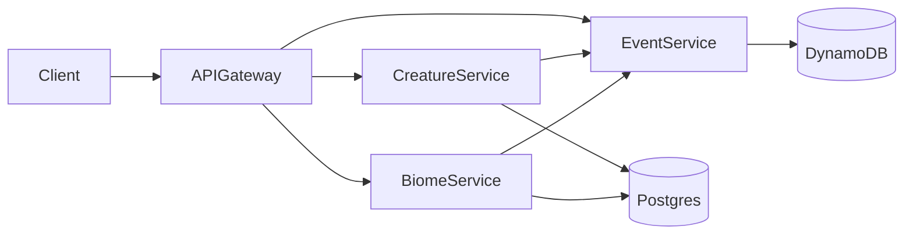
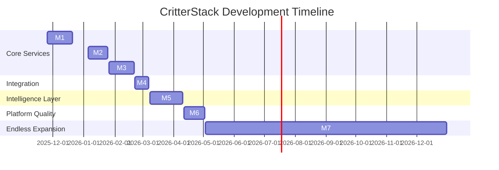

# CritterStack
*A distributed microservice ecosystem maintained by the Department of Peculiar Creatures.*

---

## Overview

CritterStack is a hands-on learning project: a whimsical ecosystem simulator built to explore backend architecture, microservices, distributed data, event-driven patterns, and clean API design.

The premise is simple:

The **Department of Peculiar Creatures** has reopened its dusty archives and needs a modern platform to catalog, monitor, and occasionally wrangle the strange fauna under its care. You’ll build that platform as a set of independent but cooperating microservices.

This project focuses on learning:

- Service boundaries and modular design
- API contracts and schema evolution
- Data modeling with Postgres & DynamoDB
- Event-based communication
- Reliability and observability patterns
- CI/CD basics and incremental delivery
- Git workflows used by senior engineers

The goal isn’t perfection — it’s *iteration*. Every service, improvement, and refactor teaches something new.

---

## High-Level Architecture

CritterStack consists of a small collection of microservices, each responsible for a slice of the ecosystem. The initial services are:

- **Creature Service** — manages creature identities, traits, stats, and lifecycle
- **Biome Service** — defines environments and biome rules
- **Event Service** — append-only historical event store
- **API Gateway** — unified entrypoint for all clients
- **Observability Stack** — logs, metrics, tracing

### Architecture Diagram



---

## Services at a Glance

### **Creature Service**
Handles:
- Creature creation
- Attributes & traits
- Domain rules (growth, stats, quirks)

Tech:
- Node.js + Fastify
- Prisma + Postgres
- Zod validation

---

### **Biome Service**
Handles:
- Biomes, climates, and special rules
- Creature–biome compatibility

Tech:
- Django REST Framework
- Postgres

---

### **Event Service**
Handles:
- Append-only event log
- Ecosystem history
- Filtering & querying

Tech:
- Node.js
- DynamoDB

---

### **API Gateway**
The single external touchpoint for all services.

Tech:
- Node.js
- Express or Fastify
- OpenAPI contract-first design

---

## Getting Started

### **Prerequisites**
- Node.js (LTS)
- Python 3.10+
- Docker (recommended)
- Postgres
- DynamoDB Local (docker or local install)

### **Local Setup**

Clone the repo:

```bash
git clone git@github.com:ElleWhitePB/CritterStack.git
cd CritterStack
```

Install service dependencies when they exist:

```bash
cd creature-service
npm install
```

Start databases (example):

```bash
docker compose up -d
```

---

## Development Workflow

### Branches

- `main` — stable
- `develop` — active development
- `feature/*` — work branches

### Commit Style

```
feat: add creature creation endpoint
fix: correct biome validation
refactor: extract event publishing
docs: add API contract
chore: update dependencies
```

### Pull Requests
Include:
- What changed
- Why
- How to test
- Risks / considerations

---

## Project Milestones (Learning Roadmap)

Each milestone focuses on a distinct backend skillset.
Taken together, they build a full distributed ecosystem.

---

### **M1: Creature Service MVP**

Kickstart the entire project with the first domain service and database layer.

Includes:
- Initialize Node service
- Docker Compose + Postgres
- Prisma schema & migrations
- `POST /creatures`
- `GET /creatures/:id`
- Zod validation
- `/health` endpoint
- Basic tests
- Documentation

---

### **M2: Biome Service MVP**

Bring in Django and DRF to establish a second service with its own domain.

Includes:
- Django + DRF project
- Postgres integration
- Biome model
- Serializers + views
- `POST /biomes`
- `GET /biomes`
- `/health`
- Integration tests
- Documentation

---

### **M3: Event Service MVP**

Append-only history with DynamoDB.

Includes:
- Service scaffold
- DynamoDB Local
- Events table
- `POST /events` append-only
- `GET /events` w/ filters
- `/health`
- Validation
- Tests
- Documentation

---

### **M4: API Gateway MVP**

Unified routing, validation, and documentation.

Includes:
- Gateway scaffold
- Proxy routes for all services
- Input validation
- Error-handling middleware
- `/health`
- OpenAPI spec
- Documentation

---

### **M5: Evolution Engine**

Intelligence layer for automated creature evolution.

Includes:
- Worker scaffold
- Redis (BullMQ or RQ)
- Scheduled evolution ticks
- Fetch creatures/biomes
- Mutation rule engine
- Append mutation events
- PATCH updates
- Idempotency keys
- Logging + tracing
- Documentation

---

### **M6: Observability & CI**

Improved reliability, debuggability, and dev experience.

Includes:
- GitHub Actions CI
- Unit tests
- Linting + type checking
- Structured logs
- Tracing IDs
- Optional `/metrics`
- Debug Docker Compose configs
- Documentation

---

### **M7: Optional Fun Zone**

An open sandbox for creative expansions.

Ideas:
- Creature interaction engine
- Inter-biome migration
- Rare anomalies
- Relationships (predator/rival/friend)
- Mini UI (React/Ember)
- Creature sprite generator
- Phenomena service

---

## Timeline



---

## Lore

Long before cloud infrastructure and compliance audits, the **Department of Peculiar Creatures** operated out of a forgotten government basement.

It was established to catalog unnatural fauna, study bizarre habitats, and keep mildly cursed phenomena from ruining the nation’s agricultural budget.

Unfortunately, all of this was tracked in dusty filing cabinets, folklore scribbles, and one deeply haunted spreadsheet.

CritterStack is the department’s attempt to modernize its research.
You're the new backend engineer tasked with building a distributed system sturdy enough to handle:

- shapeshifting organisms
- ecosystems that ignore physics
- creatures who keep unionizing
- and biomes that occasionally bite back

Good luck.
The department believes in you, mostly because everyone else quit.

---

## Roadmap (Future Ideas)

- Full creature interaction engine
- Turn-based evolution tick
- UI dashboard (React/Ember)
- Distributed tracing
- Retry/backoff logic
- Event replay
- Creature breeding
- Phenomena service

---

## License

(Choose a license soon — or release the creatures upon trespassers.)

---

## Contact

If you find a creature loose in the ducts, please contact Facilities.
They stopped responding last Tuesday, but we remain optimistic.
