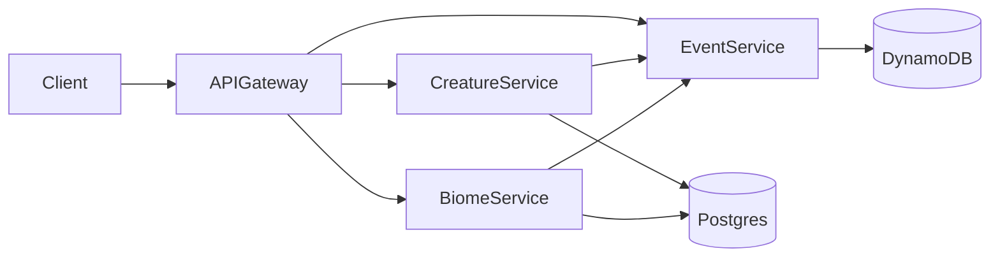

# CritterStack
*A distributed microservice ecosystem maintained by the Department of Peculiar Creatures.*

---

## Overview

CritterStack is a hands-on learning project: a whimsical ecosystem simulator built to explore backend architecture, microservices, distributed data, event-driven patterns, and clean API design.

The premise is simple:
The **Department of Peculiar Creatures** has reopened its dusty archives and needs a modern platform to catalog, monitor, and occasionally wrangle the strange fauna under its care. You’ll build that platform as a set of independent but cooperating microservices.

This project focuses on learning:

- Service boundaries and modular design
- API contracts and schema evolution
- Data modeling with Postgres & DynamoDB
- Event-based communication
- Reliability and observability patterns
- CI/CD basics and incremental delivery
- Git workflows used by senior engineers

The goal isn’t perfection — it’s *iteration*. Every service, improvement, and refactor teaches something new.

---

## High-Level Architecture

CritterStack consists of a small collection of microservices, each responsible for a slice of the ecosystem. The initial services are:

- **Creature Service** — manages creature identities, traits, stats, and lifecycle.
- **Biome Service** — defines environments and biome rules that influence creatures.
- **Event Service** — records cross-service interactions and ecosystem history.
- **API Gateway** — a unified entrypoint for clients (CLI, UI, other services).
- **Shared Observability Stack** — logs, metrics, and tracing.

Below is the very first architecture sketch.



---

## Services at a Glance

### **Creature Service**
Handles:
- Creature creation
- Attributes and traits
- Internal rules (growth, randomness, events)

Tech suggestions:
- Node.js + Fastify
- Prisma + Postgres
- Zod for API validation

### **Biome Service**
Handles:
- Biomes, climates, and regions
- Habitat-specific rules
- Creature–biome compatibility

Tech suggestions:
- Django REST Framework
- Postgres
- Celery (optional later)

### **Event Service**
Handles:
- Logging interactions
- Time-based events
- “Ecosystem memory”
- Append-only storage

Tech suggestions:
- Node.js
- DynamoDB
- EventBridge or a tiny queue later on

### **API Gateway**
A single interface to all services.

Tech options:
- Node.js
- Express / Fastify
- OpenAPI contract-first design

---

## Getting Started

### **Prerequisites**
- Node.js (LTS)
- Python 3.10+
- Docker (optional but recommended)
- Postgres running locally (Docker or local install)
- AWS local DynamoDB (DynamoDB Local or docker image)

### **Local Setup**

Clone the project:

```bash
git clone git@github.com:ElleWhitePB/CritterStack.git
cd CritterStack
```

Install dependencies once services exist. For now, this is placeholder text:
```bash
cd creature-service
npm install
```

Spin up databases (example for Docker Compose):
```bash
docker compose up -d
```

---

## Development Workflow

This repo follows a clean but beginner-friendly workflow:

### **Branches**
- `main` — your stable, working branch
- `develop` — your active development branch
- feature branches:
  - `feature/creature-endpoints`
  - `feature/biome-db-model`

### **Commit Style**
```
feat: add creature creation endpoint
fix: correct biome climate validation
refactor: extract event publisher logic
docs: add API contract for Creature Service
chore: update dependencies
```

### **Pull Requests**
PRs should include:
- What changed
- Why it changed
- How to test it
- Anything risky to watch for

Future you will thank you.

---

## Project Milestones (Learning Roadmap)

### **Milestone 1 — Boot the Project**
- Set up folder structure
- Create empty service skeletons
- Add Docker Compose for Postgres + Dynamo
- Write the first endpoints (`GET /health`)
- Commit early, commit often

### **Milestone 2 — Creature Service MVP**
- Postgres migrations
- Prisma schema
- `POST /creatures`
- `GET /creatures/:id`
- Basic validation

### **Milestone 3 — Biome Service MVP**
- Django project + app
- Postgres models
- Basic CRUD

### **Milestone 4 — Event Service MVP**
- Dynamo table
- Append event
- Fetch timeline

### **Milestone 5 — API Gateway**
- Route requests to services
- Handle errors gracefully
- Add OpenAPI doc

---

## Lore

Long before cloud infrastructure and compliance audits, the **Department of Peculiar Creatures** operated out of a forgotten government basement.

It was established to catalog unnatural fauna, study bizarre habitats, and keep mildly cursed phenomena from ruining the nation’s agricultural budget.

Unfortunately, all of this was tracked in dusty filing cabinets, folklore scribbles, and one deeply haunted spreadsheet.

CritterStack is the department’s attempt to modernize its research.
You're the new backend engineer who has to figure out how to build a distributed system sturdy enough to handle:

- shapeshifting organisms
- ecosystems that ignore physics
- creatures who keep unionizing
- and biomes that occasionally bite back

Good luck.
The department believes in you, mostly because everyone else quit.

---

## Roadmap (Future Ideas)
- Creature interaction engine
- Turn-based evolution tick
- A tiny UI using React or Ember
- Cross-service tracing
- Retry logic & backoff strategies
- Event replay
- Creature breeding (chaos mode)
- A “phenomena service” for magical anomalies

---

## License

---

## Contact
If you find a creature loose in the ducts, please contact Facilities. They stopped responding last Tuesday, but we remain optimistic.
